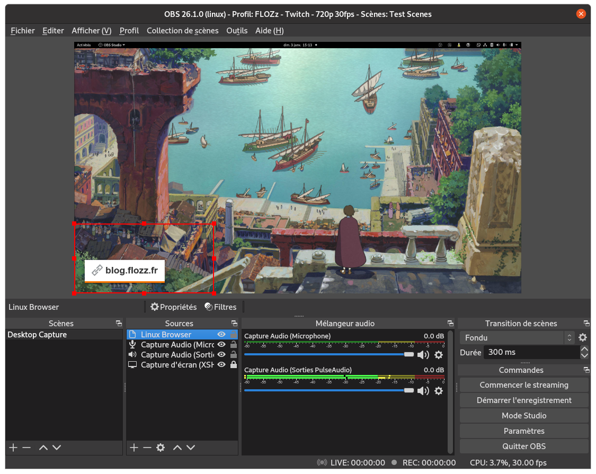

# 01 - Basic OBS Notification

This example consists of a simple web page that can be integrated to OBS to display a link at regular interval.

This example is related to an article on my blog (in French):

* https://blog.flozz.fr/2021/01/05/decouverte-des-apis-twitch-1-creation-dapplications-et-integration-a-obs/

