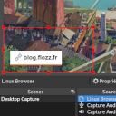
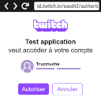

# Twitch API Examples

This repository contain examples that use Twitch APIs to display follow, sub, bits and channel-points related notifications in OBS.

The examples are related to articles on my blog (in French), you can find the first one of the serie here:

* https://blog.flozz.fr/2021/01/05/decouverte-des-apis-twitch-1-creation-dapplications-et-integration-a-obs/


## Examples Index

|                                                 | Name                                                                    | Description                                                            |
|-------------------------------------------------|-------------------------------------------------------------------------|------------------------------------------------------------------------|
|       | [01 - Basic OBS Notification](./01-basic-obs-notification/)             | Integration of a Web page in OBS to display a link at regular interval |
|  | [02 - Twitch Authentication (OAuth)](./02-twitch-authentication-oauth/) | Twitch authentication using the OAuth Implicite Code Flow              |


## License

The examples in this repository are licensed under WTFPL unless otherwise stated:

```
        DO WHAT THE FUCK YOU WANT TO PUBLIC LICENSE
                    Version 2, December 2004

 Copyright (C) 2004 Sam Hocevar <sam@hocevar.net>

 Everyone is permitted to copy and distribute verbatim or modified
 copies of this license document, and changing it is allowed as long
 as the name is changed.

            DO WHAT THE FUCK YOU WANT TO PUBLIC LICENSE
   TERMS AND CONDITIONS FOR COPYING, DISTRIBUTION AND MODIFICATION

  0. You just DO WHAT THE FUCK YOU WANT TO.
```
